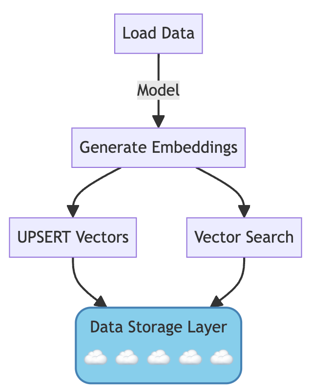

# Pinecone Serverless Starter Project

## Table of Contents
- [Overview](#overview)
- [Quick Start](#quick-start)
- [Project Workflow](#project-workflow)
- [Main Files](#main-files)
- [Supplemental Files](#supplemental-files)
- [Requirements](#requirements)
- [Installation](#installation)
- [Configuration](#configuration)
- [Scripts Usage](#scripts-usage)
    - [Step 1: Create and Load Data](#step-1-create-and-load-data)
    - [Step 2: Vector Search](#step-2-vector-search)
- [Notebooks Usage](#notebooks-usage)
- [Contact](#contact)


## Overview
This project demonstrates how to use Pinecone with embedding models from Hugging Face and OpenAI to process, embed, and search textual data. Pinecone allows for efficient similarity search and recommendation systems by storing and querying high-dimensional vectors.

## Quick Start
1. Clone the repository
2. Install dependencies
3. Set up Pinecone account and create an index
4. Configure API keys
5. Run `create_load.py` to embed and upsert data
6. Run `vector_search.py` to perform a vector search

## Project Workflow



## Main Files
- `config.ini`: Configuration file containing the Pinecone API key and OpenAI API key.
- `create_load.py`: Script for loading data, creating embeddings using the Hugging Face `sentence-transformers/all-MiniLM-L6-v2` model, and upserting data to Pinecone.
- `vector_search.py`: Script for executing a vector search query based on a user-inputted query/question using the Hugging Face embedding model.
- `pinecone101.ipynb`: Notebook to demonstrate the end-to-end process of loading data, creating embeddings, and executing a vector search query.
- `demo_doctor_notes.jsonl`: Sample data file containing doctor notes for demonstration purposes.

## Supplemental Files
- `create_load_openai.py`: Script for loading data, creating embeddings using the OpenAI `text-embedding-ada-002`, and upserting data to Pinecone.
- `vector_openai.py`: Script for executing a vector search query based on a user-inputted query/question using the OpenAI embedding model.
- `sample_data_generator.py`: Script to generate sample data for demonstration purposes.

## Requirements
- Python 3.9 or higher
- `pinecone-client`
- `transformers`
- `torch`
- `pandas`

## Installation
1. Clone the repository:
    ```bash
    git clone https://github.com/brickj/pinecone_starter_v1.git
    ```
2. Install the required packages:
    ```bash
    cd pinecone_starter_v1
    python -m venv venv
    source venv/bin/activate  # On Windows use `venv\Scripts\activate`
    pip install -r requirements.txt
    ```

## Configuration
Set your Pinecone API key in `config.ini`:
    ```ini
    PINECONE_API_KEY = your_pinecone_api_key
    ```

## Scripts Usage
### Step 1: Create and Load Data
Run the main `create_load.py` script to embed the data from `demo_doctor_notes.jsonl` and UPSERT data to Pinecone:
```bash
python create_load.py
```

    
### Step 2: Vector Search

Run the `vector_search.py` script to execute a vector search query:

```bash
python vector_search.py
```

## Notebooks Usage

Run the `pinecone101.ipynb` notebook to UPSERT data from `sample_notes_data.jsonl`, and execute a vector search query.

## Contact

For questions or support, please contact Rick Jacobs at [rick@pinecone.io](mailto:rick@pinecone.io).
